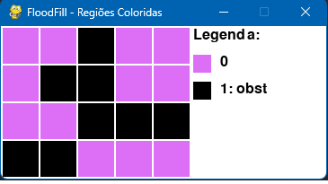
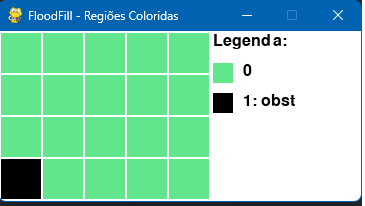

# FloodFill - Colorindo regiões de um terreno com obstáculos

Este projeto implementa de forma interativa o algoritmo Flood Fill (varredura em largura) para colorir regiões conectadas de um grid 2D, evitando obstáculos.

### Autores:

- Claudio Manoel Jansen de Oliveira
- Nathan Gonçalves de Oliveira
- Rafael Ferreira Fernandes

## Funcionalidades:

O FloodFill é uma aplicação em Python que:

- Entrada flexível: escolha entre geração automática de grid aleatório ou inserção manual linha a linha.

- Preenchimento de regiões: inicia em uma célula livre (0) e colore todas as células adjacentes ortogonalmente.

- Cores dinâmicas: cada região recebe uma cor única, exibida com legenda.

- Visualização em tempo real: mostra o grid antes e depois do preenchimento em janelas Pygame.

- Relatório no terminal: exibe o grid inicial e final em texto.

## Sobre o funcionamento do Algoritmo

O Flood Fill é uma técnica de varredura em largura (BFS) que colore regiões conectadas de um grid:

- Início: recebe coordenadas iniciais (sx, sy) em uma célula livre.

- Fila (queue): usa collections.deque para gerenciar células a processar.

- Processo:

    - Marca a célula inicial com a cor atual (inteiro ≥2).

    - Remove da fila a próxima célula (i, j).

    - Para cada vizinho ortogonal (acima, abaixo, esquerda, direita) com valor 0:

        - Define seu valor igual à cor atual.

        - Adiciona à fila para processamento posterior.

- Repetição até a fila esvaziar, garantindo que toda região conectada seja preenchida.

- Múltiplas regiões: após preencher a região inicial, varre o grid para cada célula ainda 0, incrementa a cor e repete o flood fill, garantindo cobertura completa.

- Esse método é garantido para colorir todas as células livres conectadas ortogonalmente e identificar regiões separadas.

## Estrutura do Código

- Importações (linhas 1–6): módulos sys, collections, pygame, random, time, math.

- Constantes (linhas 8–16): configurações de tamanho de célula, margem, FPS, largura da legenda e paleta inicial.

- generate_random_grid (linhas 18–20): função que retorna um grid n×m com obstáculos distribuídos aleatoriamente.

- read_inputs (linhas 22–50): lê n, m, escolhe modo (Automático ou Manual), gera ou lê o grid e captura coordenada inicial válida.

- flood_fill (linhas 52–62): implementa BFS ortogonal para preencher uma única região com a cor fornecida.

- fill_all_regions (linhas 64–73): chama flood_fill para a região inicial e, em seguida, varre todo o grid para preencher outras regiões, incrementando a cor.

- get_color (linhas 75–79): retorna cor RGB de PALETTE ou gera uma nova cor aleatória para cada valor de célula.

- display_graphical (linhas 81–114): abre janela Pygame, desenha o grid e a legenda, exibindo cores e legendas até o usuário fechar a janela.

- print_grid (linhas 116–120): imprime no terminal o grid atual, linha a linha.

- main (linhas 122–129): fluxo principal de execução — lê entradas, mostra grid inicial (terminal e GUI), executa flood fill, mostra grid final (terminal e GUI).

## Como Executar o Projeto

### Pré-requisitos
- Python 3.6 ou superior
- pygame

### Instalação das Dependências

bash
pip install pygame

1. Clone o repositório:

       git clone https://github.com/nATHANnSil/FPAA-Trabalhos-em-Grupo/tree/main

       cd FPAA-Trabalhos-em-Grupo/TrabalhoGrupo2
   

3. Execute o código: 
    
        python main.py
    

4. Siga as instruções no terminal:

-  Informe n = número de linhas e m = número de colunas.

-  Escolha o modo de geração do grid:

    - A: geração automática (grid aleatório com 30% de obstáculos).

    - M: inserção manual (digite cada linha com valores 0 ou 1).

- Informe as coordenadas iniciais (linha e coluna) de uma célula livre (0).

- O programa exibirá:

    - Grid inicial no terminal.

    -  Janela Pygame com visualização do grid antes do preenchimento.

    - Grid final no terminal, mostrando as regiões numeradas.

    - Janela Pygame com visualização do grid colorido por região.

## Exemplo de Entrada e Saída:

### Modo Manual

Entrada: 

    Número de linhas (n)? 4
    Número de colunas (m)? 5
    Gerar grid automaticamente ou manualmente? [A/M]: M
    Insira o grid 4×5, linha a linha
    Saída (no terminal):
    
    Grid final:

    0 0 1 0 0
    0 1 1 0 0
    0 0 1 1 1
    1 1 0 0 0

Além disso, a janela gráfica mostra a execução do grid preenchido.

### Modo automático

Entrada: 

    Número de linhas (n)? 4
    Número de colunas (m)? 5
    Gerar grid automaticamente ou manualmente? [A/M]: A
    Gerando grid aleatório...
    Grid gerado:

Saída (no terminal): 

No modo automático, após a criação do grid, o terminal solicita as coordenadas iniciais, e mostra o grid criado.

## Licença

Este projeto está licenciado sob a Licença MIT.
